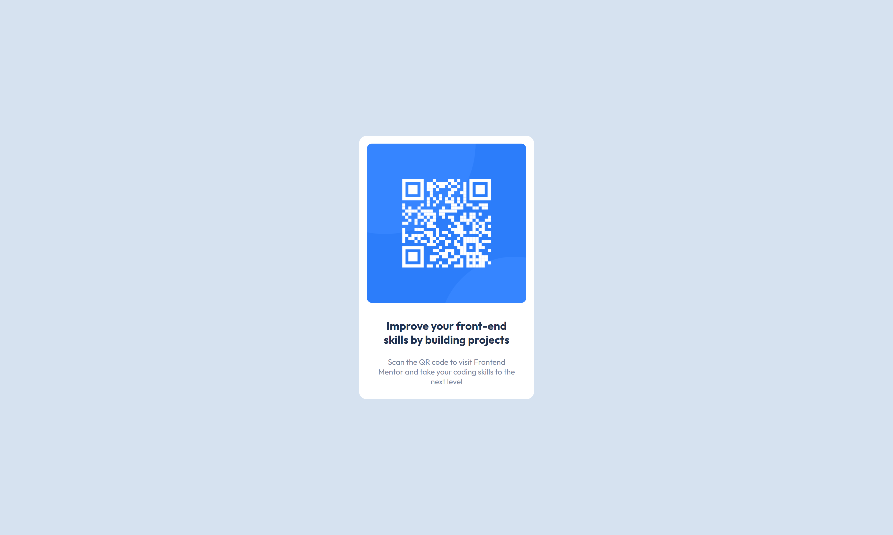

## Table of contents

- [Overview](#overview)
  - [Screenshot](#screenshot)
  - [Links](#links)
- [My process](#my-process)
  - [Built with](#built-with)
- [Author](#author)
- [Acknowledgments](#acknowledgments)

**Note: Delete this note and update the table of contents based on what sections you keep.**

## Overview

QR code component.

### Screenshot

### Links

- Solution URL: [QR Component Repo]([https://your-solution-url.com](https://github.com/faizann7/QR-code-component))
- Live Site URL: [QR Component](https://faizann7.github.io/QR-code-component/)

## My process

### Built with

- Semantic HTML5 markup
- CSS custom properties
- Flexbox

## Author

- Website - [Muhammad Fazian](https://faizann7.github.io/portfolio/)

## Acknowledgments
